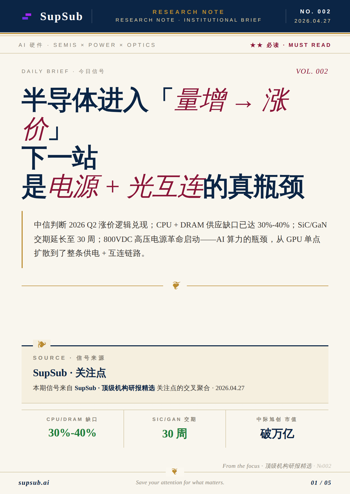
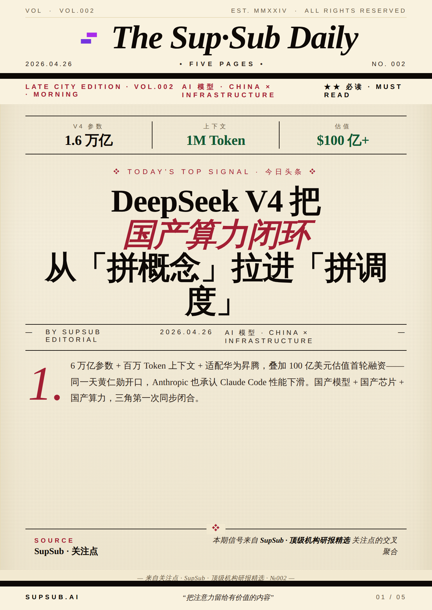
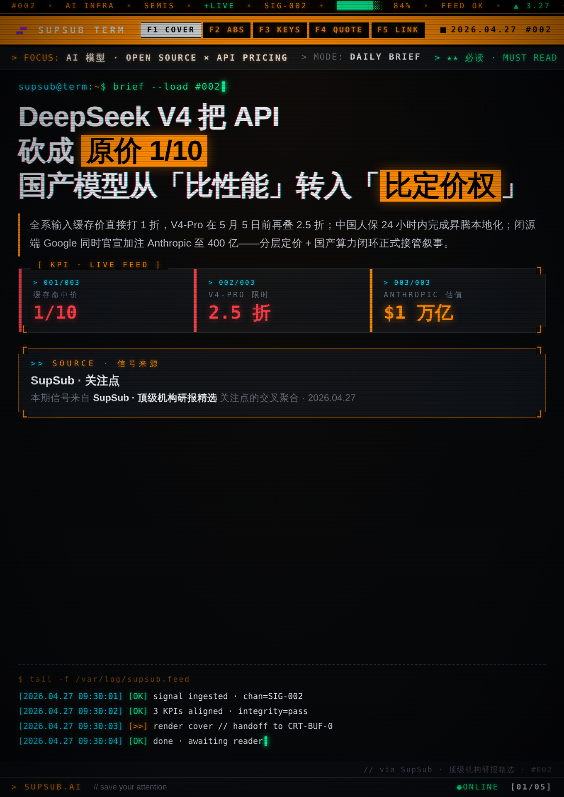
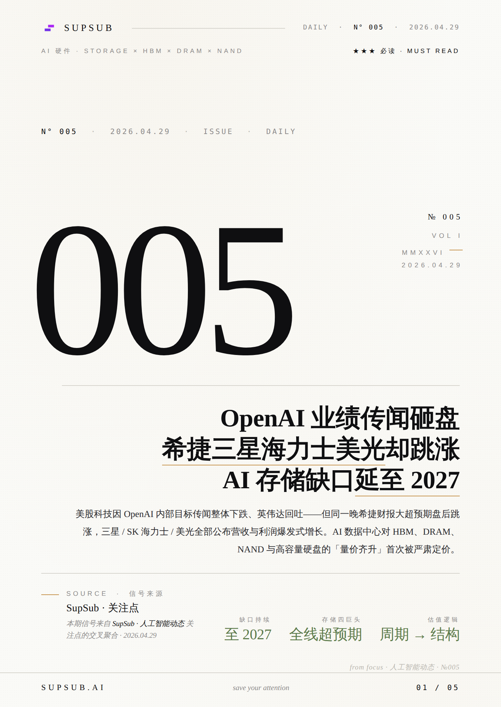

# 金融信息卡片自动化工作流

一套面向财经博主、内容创作者的 **小红书 / 朋友圈金融卡片自动产线**：
每天早上 09:00 自动从信源抓取当日信号、整理为话题、按风格渲染成 5 张可直接发布的竖版卡片（720×960，3:4）。

整套流程不需要你动手设计或排版，**当天醒来就能拿到当日 3 期成品**。
你可以拿这套流水线复刻到自己的内容方向（财经、科技、行业研究皆可），换信源、换品牌、换风格，工作流不变。

## 一期话题 = 5 张卡片

| 顺序 | 卡片 | 用途 |
|---|---|---|
| 1 | **封面** | 大标题 + 导语 + 三栏数据（如 BRENT $100 / +14% / $600/吨） |
| 2 | **摘要** | 完整事件梳理 + 编者按 |
| 3 | **要点** | 3-5 条结构化速读 |
| 4 | **金句** | 一句话点睛 + 署名 |
| 5 | **延伸阅读** | 分组导引到进一步内容 |

每张卡固定位置嵌入了 Logo / 期号 / 页脚链接 / 合规话术 / 尾页 slogan，发布出去就是统一的品牌语言；这些品牌位都是模板里的占位，可以替换成你自己的账号信息。

## 卡片风格

四套风格共享一份内容数据，按周自动轮换；也支持指定或随机。
关键词高亮在每套风格里映射到不同重音色（陈年金 / 报纸红 / 磷光绿 / 熔金）。

| `research` 机构研报风 | `wsj` 华尔街日报风 |
|---|---|
|  |  |
| 深蓝报眉 + 陈年金重音，Foreign Affairs × HBR 学术月刊质感 | 1890s 活版铅印大报，drop cap 首字下沉，纸黄底 + 报纸红 |
| **`bloomberg` 彭博终端风** | **`minimal` 财报极简** |
|  |  |
| 黑底磷光绿 + 琥珀色，CRT 扫描线 + ASCII 盒线，终端任务控制台 | Muji × Kinfolk × NYT Weekend，大量留白 + 0.5px 发丝线 + 熔金重音 |

## 每日自动产出

每天 **09:00 Asia/Shanghai** 跑一次，整套流水线三步：

1. 抓取当日信源 / 关注点
2. 挑 3 条主线，每条整理为一份话题数据
3. 用当周风格渲染 3 期 × 5 张 = **15 张 PNG**

### 两种触发方式（用哪个看场景）

| 入口 | 适用场景 | 是否自动入库 |
|---|---|---|
| **`/daily-cards`** （[`.claude/skills/daily-cards/SKILL.md`](.claude/skills/daily-cards/SKILL.md)） | 本地手动触发，想发布前先审阅内容、风格、配图再决定是否保留 | 否，只生成图片，由你审阅后再决定是否归档 |
| **`instructions.md`**（[`instructions.md`](instructions.md)） | 早上 09:00 的远程定时任务，目标是醒来直接看到当日成品 | 是，跑成功后自动归档进当日目录，无需人工干预 |

两者共用同一份模板、同一份渲染脚本，差别只在「跑完后是否自动归档」。手动试跑选第一种，每天定时跑选第二种。

成品落在 `output/YYYY-MM-DD/<话题>/` 下，每期一个目录：

```
output/2026-04-29/
├── AI存储缺口-量价齐升/
│   ├── 1-封面.png
│   ├── 2-摘要.png
│   ├── 3-要点.png
│   ├── 4-金句.png
│   ├── 5-延伸阅读.png
│   └── keyword.json        话题关键词（小红书发布时贴标签用）
├── AI存储缺口-量价齐升.zip   上面 6 个文件的同名打包，方便一键转发
├── 阿联酋退欧佩克-油价冲击/
├── 阿联酋退欧佩克-油价冲击.zip
└── ...
```

发布时直接打开当天目录、挑一期、5 张图按顺序排好上传即可；也可以用同名 zip 整包转发给运营。

## 期号

每张卡右上角的 `№ 005` 是该风格的累计期号（不是日历日期）。
四套风格各自独立计数，跨天连续累加，方便追踪「这是 minimal 风格的第几期」。

## 想复刻这套流程

- 话题数据字段定义见 [`tools/schema.md`](tools/schema.md)
- 渲染脚本入口：`tools/scripts/build_cards.py <topic.json> --style random`
- 模板放在 `tools/templates/<风格名>/`，每套风格 9 个文件（CSS + 页眉/页脚 + 5 张卡），可以照样新增第五、第六种风格
- 信源、品牌位、CTA、slogan、合规话术都是模板里的占位字段，替换后即可绑定到自己的账号
- 自动化 prompt 改写参考 [`instructions.md`](instructions.md)（无人值守版）和 [`.claude/skills/daily-cards/SKILL.md`](.claude/skills/daily-cards/SKILL.md)（本地交互版）
